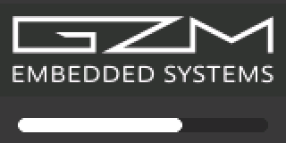

# Do Código ao Campo: Validando Firmware com Zephyr RTOS

> Demo da palestra: **atualização de firmware pela UART com o serial recovery
> do MCUboot, imagens assinadas e rollback automático**, Fórum de Sistemas
> Embarcados e IoT 2026 (Portal Embarcados).
> Palestrante: **Jorge Guzman**

A placa roda uma pequena aplicação de gestão de usuários: a biblioteca interna
**gzm/user_mgr** (usuários com senha em hash PBKDF2, no máximo 50) sobre
LittleFS na NOR SPI externa, com um display LVGL mostrando os usuários
cadastrados e os bloqueados. A demo atualiza o firmware por uma UART comum: o
serial recovery do MCUboot recebe uma imagem **assinada** na **NOR QSPI
externa**, troca para a flash interna e dá boot em modo *test*: confirme, ou
ela volta para a versão anterior no próximo reboot. As imagens são
**assinadas (ECDSA P-256) e criptografadas (ECIES P-256)**: o slot1 só guarda
texto cifrado.

**Este README segue os capítulos da palestra.** Os slides trazem só a ideia;
os comandos completos e os detalhes ficam aqui, com o mesmo número de capítulo
(`README · cap. 04` num slide → [04 · ztest e Twister](#04--ztest-e-twister)).

| Capítulo | Assunto |
|----------|---------|
| [01](#01--introdução-ao-zephyr) | Introdução ao Zephyr: hardware, arquivos do projeto, a app da demo |
| [02](#02--simuladores) | Simuladores: native_sim e Renode |
| [03](#03--manifest) | Manifest: workspace do west, build e gravação |
| [04](#04--ztest-e-twister) | ztest e Twister: os projetos de teste, um comando para todos os alvos, cobertura |
| [05](#05--bootloader-mcuboot) | Bootloader: chaves do MCUboot, a imagem e a proteção da flash |
| [06](#06--atualização-em-campo) | Atualização em campo: nosso atualizador (GUI) |
| [07](#07--robot-framework) | Robot Framework: testes de aceitação na placa real |
| [08](#08--rodando-a-demo) | Rodando a demo: a sequência ao vivo, debug, tasks do VS Code |

---

## 01 · Introdução ao Zephyr

### Hardware

* **PC:** Ubuntu 22.04 / 24.04
* **Placa:** WeAct Studio MiniSTM32H743
  * MCU: STM32H743VIT6 (Cortex-M7 a 480 MHz, 2 MB de flash, 1 MB de RAM)
  * Display: ST7735R 160x80 (SPI4)
  * NOR externa: W25Q64 8 MB QSPI (**slot1 do MCUboot**) + W25Q64 8 MB SPI1
    (**armazenamento dos usuários**: LittleFS com blocos de 4 KB)
* **Adaptador USB-serial** (que suporte 921600 baud) para a porta de atualização
* **ST-Link** no SWD para a primeira gravação e para o debug
* **Zephyr RTOS:** v4.4.1

| Sinal                  | Pino da placa | Vai para                     |
|------------------------|---------------|------------------------------|
| UART4 TX (atualização) | PA0           | RX do adaptador USB-serial   |
| UART4 RX (atualização) | PA1           | TX do adaptador USB-serial   |
| Console / shell        | USB-C         | PC (CDC ACM, `/dev/ttyACM0`) |
| SWD                    | SWDIO / SWCLK | ST-Link                      |

Use os caminhos `/dev/serial/by-id/...` para as portas: o console USB some e
volta a cada reboot, muitas vezes com outro número de `ttyACM`.

### Estrutura do projeto

```
├── app/                    ← aplicação (usuários + UI LVGL + shell de boot)
│   ├── boards/             ← overlays: partição LittleFS, slot0, SDL no native_sim
│   ├── sysbuild/           ← config + overlay do MCUboot (recovery na UART4, slot1 na QSPI)
│   ├── inc/ src/           ← fases do setup, users_app, ui_app, shell de boot
│   ├── debug.conf          ← opções de debug, carregado em todo build, comentado
│   └── VERSION             ← versão do firmware (aparece no display)
├── boards/witte/           ← placa fora da árvore do Zephyr (WeAct MiniSTM32H743)
│   └── .../support/        ← a placa do Renode (.repl + .resc)              (cap. 02)
├── gzm/                    ← bibliotecas internas como módulo Zephyr (user_mgr, fs_mgr)
├── manifest/west.yml       ← Zephyr e módulos em versão fixa               (cap. 03)
├── tests/                  ← projetos ztest (cap. 04) + robot/ (cap. 07)
│   ├── user_mgr/           ← a biblioteca na LittleFS (PC + placa), limite de 50
│   ├── fs_mgr/             ← a camada de arquivos na LittleFS (PC + placa), queda de energia
│   ├── user_mgr_mock/      ← fakes FFF do armazenamento (PC)
│   └── robot/              ← Robot Framework: usuários, atualização, velocidade do upload
├── tools/keys/             ← gerador das chaves da demo (genkeys.sh)       (cap. 05)
├── tools/flasher/          ← nosso atualizador: GUI (+ a CLI que o Robot usa) (cap. 06)
├── tools/twister/          ← o Twister grava a placa pela UART4             (cap. 04)
├── tools/debug/            ← STM32H743.svd (registradores no debug por ST-Link)
├── tools/assets/           ← logos
└── doc/img/                ← imagens deste README
```

### A app da demo: os usuários (gzm/user_mgr)

`gzm/` guarda bibliotecas internas empacotadas como **módulo Zephyr**
(`gzm/zephyr/module.yml`) dentro deste repositório; o `app/CMakeLists.txt` e
os projetos de teste o adicionam com `ZEPHYR_EXTRA_MODULES`, então não é
preciso outro projeto no west. Só duas bibliotecas são usadas aqui:

* `gzm/lib/user_mgr`: um arquivo por usuário em qualquer sistema de arquivos
  do Zephyr; a senha nunca é guardada: PBKDF2-HMAC-SHA256 (PSA Crypto API) com
  salt aleatório. Inclui os comandos de shell `user …`.
* `gzm/lib/fs_mgr`: montagem/formatação e funções de arquivo seguras contra
  queda de energia.

A app (`app/src/users_app.c`) monta a LittleFS na partição escolhida no
devicetree (`chosen { app,users-partition = … }`: a NOR SPI na placa, uma
partição do simulador de flash no native_sim) e cria um admin padrão quando o
armazenamento está vazio. `app/Kconfig`:

| Opção | Padrão | Significado |
|-------|--------|-------------|
| `CONFIG_APP_USER_MGR_MAX` | 50 | capacidade (admin incluído); depois disso o `user add` falha com `-28` (`-ENOSPC`) |
| `CONFIG_APP_ADMIN_ID` | 1 | id do admin padrão |
| `CONFIG_APP_ADMIN_PASSWORD` | `1234` | senha do admin padrão (valor de demo, só no primeiro boot) |

Comandos do shell (console USB):

```text
user count                                   # "N users (M admins enabled)"
user add <id> <level> <first> <last> <pwd>   # ex.: user add 1001 user Usuario Teste01 Senha01
user login <id> <pwd>                        # "ok: …" ou "login failed (-13)"
user set_status <id> <0|1>                   # 0 = bloqueado, 1 = habilitado
user del <id>   ·   user show_all   ·   user levels   ·   user set_pwd   ·   user rename
```

Os arquivos dos usuários podem ser vistos com o shell do sistema de arquivos
(`CONFIG_FILE_SYSTEM_SHELL`):

```text
fs ls /lfs/users        # um <id>.bin por usuário (146 bytes: salt + chave, nunca a senha)
fs statvfs /lfs         # 2048 blocos de 4 KB na NOR SPI
```

Na placa, um `user add` leva cerca de 0,5 s e um `user login` cerca de 0,4 s
(PBKDF2 com 10 000 iterações); os testes usam 1 000 iterações.

---

## 02 · Simuladores

### native_sim: o firmware como programa do PC

A mesma aplicação compila para o PC: a UI LVGL abre numa janela SDL (zoom 2x)
mostrando os usuários (`N/50`) e os bloqueados, e os usuários ficam na
LittleFS do simulador de flash, sem nenhum hardware. A flash simulada é o
arquivo `flash.bin` na pasta de onde o programa roda (`app/build_native`): os
usuários sobrevivem entre execuções; apague o arquivo para começar do zero. O
shell fica num pseudo-terminal (o caminho aparece na inicialização) ou, com
`-uart_stdinout`, no próprio terminal: experimente
`user add 1001 user Usuario Teste01 Senha01`.

```bash
# task "Native Build"
west build -b native_sim/native/64 -p auto -s app -d app/build_native -- -DBOARD_ROOT=$PWD \
    -DEXTRA_CONF_FILE=debug.conf

# task "Native Run"
cd app/build_native && ./zephyr/zephyr.exe
```

 

### Renode: o binário real num STM32H743 emulado

O modelo da placa para o Renode 1.17 é
`boards/witte/weact_stm32h743/support/weact_stm32h743.repl` (mais o script
`weact_stm32h743.resc`), e o yaml da placa declara o Renode como simulador. O
`.repl` foi gerado a partir do devicetree com o dts2repl e depois corrigido à
mão: a SPI do H7 saiu com o modelo do F4 (outro mapa de registradores) e
faltou o controlador de flash.

```bash
pip install git+https://github.com/antmicro/dts2repl
dts2repl app/build/app/zephyr/zephyr.dts -o weact_stm32h743.repl
```

O display ST7735R, as NORs W25Q e o cartão SD não têm modelo pronto no Renode.

---

## 03 · Manifest

Siga o
[Getting Started Guide](https://docs.zephyrproject.org/latest/develop/getting_started/index.html)
do Zephyr (SDK + west). Depois, na raiz do repositório:

```bash
# task "Manifest: Fetch (west init + update)"; pula o west init quando o .west/ já existe
west init -l manifest
west update
west zephyr-export
```

* `west init -l manifest` não baixa nada: só cria o `.west/config`, que diz ao
  west onde está o manifest (`manifest/west.yml`) e, depois do primeiro
  comando, onde está o Zephyr (`zephyr.base`). Ele transforma esta pasta num
  workspace do west; rode uma vez só (na segunda, ele para com
  `already initialized`).
* `west update` lê o `manifest/west.yml` e baixa `zephyr/`, `modules/` e
  `bootloader/`, cada projeto na revisão fixada. Rode de novo depois de mudar
  um `revision` no manifest.
* Todo `west build`/`west twister` rodado dentro desta pasta encontra o
  `.west/` e usa o `zephyr/` deste workspace, então vários workspaces com
  versões diferentes do Zephyr convivem lado a lado. Não exporte `ZEPHYR_BASE`
  no shell: ele vence o `.west/config` em todos os workspaces.

O `manifest/west.yml` fixa o Zephyr v4.4.1 e uma **allowlist** de módulos: só
o que está na lista é baixado. Se o código usar uma biblioteca de um módulo que
não está na lista (lvgl, littlefs, um HAL…), o build falha: acrescente o módulo
e rode `west update` de novo. O `west list` mostra cada projeto na revisão
fixada. `.west/`, `zephyr/`, `modules/` e `bootloader/` estão no `.gitignore`.

A task oposta, **Manifest: Clean**, apaga o que o west baixou (`zephyr/`,
`modules/`, `bootloader/`) e o `.west/`, depois de uma confirmação; serve para
mostrar o workspace sendo recriado só a partir do `manifest/west.yml`.

### Build e gravação

As chaves da demo precisam existir antes do primeiro sysbuild (veja o
[cap. 05](#05--bootloader-mcuboot)):

```bash
# task "Generate Demo Keys"
./tools/keys/genkeys.sh
```

```bash
# MCUboot + app assinada e criptografada num build só (task "West Build")
west build -b weact_stm32h743 --sysbuild -p auto -s app -d app/build -- -DBOARD_ROOT=$PWD \
    -Dapp_EXTRA_CONF_FILE=debug.conf

# ST-Link (task "West Flash (ST-Link)", que roda o "West Build" antes):
# o MCUboot, depois a app assinada
west flash -d app/build --runner stm32cubeprogrammer --domain mcuboot
west flash -d app/build --runner stm32cubeprogrammer --domain app

# Só a app, sem MCUboot (para análise)
west build -b weact_stm32h743 -p always -s app -d app/build_nomcuboot -- -DBOARD_ROOT=$PWD
```

Existe um build só, para rodar e para depurar: o `app/debug.conf` é sempre
carregado e vem com as opções comentadas, então a imagem que você grava ou
atualiza é a de release. Para depurar, descomente as opções; o próximo build
já pega a mudança (sem precisar de build pristine):

| Opção | Sem ela | Com ela |
|-------|---------|---------|
| `CONFIG_DEBUG_OPTIMIZATIONS` | `-Os`: o passo a passo pula linhas, `<optimized out>` | `-Og`: o passo a passo segue o código (app ≈ 372 KB → 450 KB) |
| `CONFIG_DEBUG_THREAD_INFO` | o debugger não lista as threads | lista as threads, mas só com um gdb server que conhece o Zephyr (OpenOCD, J-Link, pyOCD); o ST-LINK_gdbserver usado aqui não conhece |

O mesmo vale para o MCUboot: o `app/sysbuild/mcuboot.conf` termina com um
`CONFIG_DEBUG_OPTIMIZATIONS=y` comentado.

A placa fica fora da árvore do Zephyr, por isso o `-DBOARD_ROOT=$PWD` nos
builds e o `--board-root .` no Twister.

---

## 04 · ztest e Twister

### Os projetos de teste (ztest)

Cada pasta em `tests/` é um projeto de teste Zephyr independente
(`testcase.yaml`, `prj.conf` com `CONFIG_ZTEST=y`, `src/*.c`, mais `boards/` e
`sysbuild/` para rodar no hardware):

| Projeto          | Onde roda                | O que verifica |
|------------------|--------------------------|----------------|
| `user_mgr`       | native_sim, placa        | `gzm/user_mgr` na LittleFS: 17 testes da biblioteca + 5 do limite de 50 usuários |
| `fs_mgr`         | native_sim, placa        | `gzm/fs_mgr` na LittleFS: 20 testes, inclusive a gravação segura contra queda de energia |
| `user_mgr_mock`  | native_sim               | o `user_mgr.c` real com fakes FFF do armazenamento (disco cheio, falha ao apagar, registro corrompido, senha nunca guardada em claro): 4 testes |

O exemplo dos slides é o `test_password_rules` (`tests/user_mgr/src/main.c`):

```c
ZTEST(user_mgr, test_password_rules)
{
    /* no password and empty password: refused */
    zassert_equal(user_mgr_add(1, "Joao", "", NULL, ACC_LEVEL_USER), -EINVAL);
    zassert_equal(user_mgr_add(1, "Joao", "", "", ACC_LEVEL_USER), -EINVAL);

    /* a valid password: accepted */
    zassert_ok(user_mgr_add(1, "Joao", "", "Senha01", ACC_LEVEL_USER));
}
```

Ele deixa de fora, de propósito, uma senha maior que o limite: o relatório de
cobertura mostra esse ramo da `user_mgr_validate_password()` em amarelo (3 de
4 executados).

* `zassert_*` para o teste na falha, `zexpect_*` registra a falha e continua,
  `zassume_*` pula o teste quando uma pré-condição não é atendida. Os três têm
  os mesmos sufixos (`_true`, `_equal`, `_ok`, `_str_equal`, …); o
  `zassert_unreachable()` só existe como assert.
* O mock (`tests/user_mgr_mock`) troca o `fs_mgr_save_file`, o
  `fs_mgr_load_file` e as chamadas `fs_*` do Zephyr por fakes FFF
  (`FAKE_VALUE_FUNC`), então um teste força um disco cheio com uma linha:
  `fs_mgr_save_file_fake.return_val = -ENOSPC;`.
* Os testes dos 50 usuários usam o mesmo padrão de nomes da suíte do Robot:
  id 1000+n, `Usuario`, `Teste<nn>`, senha `Senha<nn>`.

> O MCUboot deixa o IWDG rodando (20 s) e ele não pode ser parado: toda imagem
> que roda por mais tempo que isso precisa alimentá-lo. A app faz isso no
> `main.c`; os testes na placa, em `tests/user_mgr/src/wdt_feed.c` e
> `tests/fs_mgr/src/wdt_feed.c`. Os testes na placa também precisam de
> `CONFIG_MAIN_STACK_SIZE=8192`: o setup da suíte monta (e, numa NOR vazia,
> formata) a LittleFS na thread main, e o padrão de 1 KB estoura na placa,
> embora passe no native_sim.

### Twister

O Twister é o executor de testes do Zephyr, escrito em Python
(`zephyr/scripts/twister`; o `west twister` chama o mesmo script). Ele procura
todo `testcase.yaml` dentro do `-T`, compila cada cenário para cada
plataforma, roda e lê o PASS/FAIL do ztest. **Todo comando deste projeto
precisa de `--board-root .`**: nossa placa fica fora da árvore, e sem isso o
Twister para com `unrecognized platform - weact_stm32h743` ao ler o yaml,
mesmo quando você pede só o native_sim.

Uma pasta vira teste com o que qualquer app Zephyr tem, mais um
`testcase.yaml`:

```text
tests/my_lib/
├── CMakeLists.txt
├── prj.conf          CONFIG_ZTEST=y
├── src/main.c        ZTEST(...)
└── testcase.yaml     ← o que o Twister procura
```

```yaml
tests:
  my_lib.unit:                 # nome do cenário
    tags: [my_lib, unit]
    platform_allow:
      - native_sim
      - qemu_x86
    integration_platforms:
      - native_sim             # usada com -G
```

O yaml não lista os testes (eles são os `ZTEST()` em C). Cada nome dentro de
`tests:` é um **cenário**: onde compilar, com quais opções e tags. Hierarquia:
cenário (yaml) → suíte (`ZTEST_SUITE`) → caso (`ZTEST`). O
`tests/user_mgr/testcase.yaml` tem dois cenários: `demo.user_mgr` (PC) e
`demo.user_mgr.board` (placa, com sysbuild); o `tests/fs_mgr` segue o mesmo
padrão. O `-p` escolhe os cenários cujo `platform_allow` tem aquela plataforma.

```bash
# PC (task "Twister (host)"): 46 de 46 casos em ~15 s
west twister --board-root . -T tests -p native_sim/native/64 -O twister-out

# Um projeto só
west twister --board-root . -T tests/user_mgr_mock -p native_sim/native/64

# Placa real pelo adaptador da UART4 (task "Twister (device)"): user_mgr + fs_mgr,
# 42 de 42 casos em ~4 min
west twister --board-root . -T tests -p weact_stm32h743 --device-testing \
    --device-serial /dev/ttyUSB0 --flash-before --device-flash-timeout 60 \
    --flash-command $PWD/tools/twister/flash_uart.py -O twister-out-device -j 1
```

Na placa, cada imagem de teste é gravada pela UART4 pelo
`tools/twister/flash_uart.py` (serial recovery do MCUboot) e espera o atraso
de boot (`CONFIG_BOOT_DELAY`), então rodar na placa não é algo para fazer ao
vivo. A execução deixa a placa com uma imagem de teste: grave a app de novo
(task "West Flash (ST-Link)") antes da demo.

| Opção | O que faz |
|-------|-----------|
| `--board-root .` | encontra nossa placa fora da árvore do Zephyr |
| `-T <pasta>` | onde procurar os `testcase.yaml` |
| `-p <plataforma>` | roda só nesta plataforma |
| `-s <cenário>` | um cenário só (ex.: `-s demo.user_mgr`) |
| `-t <tag>` / `-e <tag>` | inclui / exclui pelas tags do yaml |
| `-G` | só as `integration_platforms` |
| `-O <pasta>` | saída (padrão `twister-out/`: `twister.json`, `twister_report.xml`) |
| `-i` · `-v` | logs na tela quando falha · mais detalhes |
| `--device-testing --device-serial <porta>` | roda no hardware real |
| `--simulation <nome>` | escolhe o simulador quando a placa declara mais de um |

Onde o binário roda é decidido pela plataforma: o `native_sim` gera um
executável Linux, as placas `qemu_*` iniciam o QEMU, nossa placa declara o
Renode no yaml, e o `--device-testing` grava a placa real.

### Ferramentas no mesmo comando

| Opção | O que acrescenta |
|-------|------------------|
| `--coverage --coverage-tool gcovr` | cobertura de linhas e ramos (task "Twister Coverage (host)") |
| `--enable-asan --enable-lsan` | acesso inválido à memória e vazamentos (native_sim) |
| `--enable-ubsan` | comportamento indefinido em C (native_sim) |
| `--enable-valgrind` | valgrind no binário do native_sim |
| `-x ZEPHYR_SCA_VARIANT=codechecker` | análise estática (CodeChecker, sparse, …) |

```bash
# Cobertura do gzm/ no PC (task "Twister Coverage (host)"): 46 de 46 em ~20 s
# relatório: twister-out-coverage/coverage/index.html
ZEPHYR_TOOLCHAIN_VARIANT=zephyr west twister --board-root . -T tests \
    -p native_sim/native/64 --coverage --coverage-tool gcovr \
    --coverage-basedir gzm -O twister-out-coverage
```

No PC, os testes cobrem 85 % das linhas do `user_mgr.c` e 73 % do `fs_mgr.c`.

---

## 05 · Bootloader (MCUboot)

### As duas chaves

| Chave | Parte privada | Parte pública | Impede |
|-------|---------------|---------------|--------|
| `demo-ecdsa-p256.pem` (assinatura, ECDSA P-256) | PC / CI: assina o firmware | dentro do MCUboot: verifica | rodar firmware alterado ou de outro produto |
| `demo-encryption-p256.pem` (criptografia, ECIES P-256 + AES-128) | dentro do MCUboot: decifra | PC / CI: cifra a imagem | ler o `.bin` (ele pode ir para técnicos e clientes) |

As duas estão no `.gitignore` (`tools/keys/*.pem`) e são **só para a demo:
nunca um fluxo de produção**. Perdeu a chave de assinatura, acabaram as
atualizações.

```bash
# task "Generate Demo Keys": não sobrescreve uma chave que já existe
./tools/keys/genkeys.sh

# o que ela roda, para cada chave:
IMGTOOL=bootloader/mcuboot/scripts/imgtool.py
python3 $IMGTOOL keygen -t ecdsa-p256 -k tools/keys/demo-ecdsa-p256.pem
python3 $IMGTOOL keygen -t ecdsa-p256 -k tools/keys/demo-encryption-p256.pem
```

O build do MCUboot embute as chaves automaticamente
(`bootloader/mcuboot/boot/zephyr/CMakeLists.txt`): `imgtool getpub -k
demo-ecdsa-p256.pem` → `autogen-pubkey.c` e `imgtool getpriv -k
demo-encryption-p256.pem` → `autogen-enckey.c`.

### Trave a flash em produção

A chave privada de criptografia fica na flash do MCUboot: com o RDP nível 0 (o
padrão), o SWD lê a flash inteira. O nível 1 bloqueia a leitura pelo debug
(voltar para o 0 apaga tudo); o nível 2 desliga o SWD para sempre. Acrescente
WRP nos setores do MCUboot para ninguém regravar o bootloader.

```bash
# RDP nível 1: NÃO rode na placa da demo a menos que seja de propósito
STM32_Programmer_CLI -c port=SWD -ob RDP=0xBB
```

### Estrutura de um slot do MCUboot

Todo slot tem o mesmo layout: header (0x400 bytes) → firmware da aplicação →
TLVs (hash, assinatura, chave AES cifrada) → espaço livre → trailer (estado da
troca) bem no final. Nesta imagem (v1.0.0):

| Parte | Tamanho |
|-------|---------|
| Header | `0x400` bytes |
| Firmware | `0x5AC60` bytes (≈ 363 KB) |
| TLVs | `0x10C` bytes (268: 4 + SHA-256 36 + KEYHASH 36 + ECDSA 75 + ENCEC256 117; a assinatura DER varia 1 a 2 bytes por imagem) |
| Livre | ≈ 507 KB (57 % do slot de 896 KB): espaço para o firmware crescer |
| Trailer | `0x60E0` bytes (24 800) |

O tamanho do trailer vem do `boot_trailer_sz()` do MCUboot
(`boot/bootutil/src/bootutil_area.c`): status da troca
`CONFIG_BOOT_MAX_IMG_SECTORS` (256) × 3 estados (swap using scratch) × 32
bytes (o bloco de escrita da flash do H7) = 24 576, mais 224 bytes de
informação (duas chaves AES, tipo da troca, copy_done, image_ok, swap_size e
o magic, cada um alinhado em 32 bytes). O
`imgtool dumpinfo zephyr.signed.encrypted.bin` mostra o header e os TLVs. As
estruturas, de `bootloader/mcuboot/boot/bootutil/include/bootutil/image.h`,
com os valores desta imagem (v1.0.0 no slot0) nos comentários:

```c
/* 0x0802_0000: início do slot0 */
struct image_header {                 /* 32 bytes      */
    uint32_t ih_magic;               /* 0x96f3b83d    */
    uint32_t ih_load_addr;           /* 0             */
    uint16_t ih_hdr_size;            /* +0x400: o código começa aqui */
    uint16_t ih_protect_tlv_size;    /* 0             */
    uint32_t ih_img_size;            /* 0x5AC60       */
    uint32_t ih_flags;               /* 0x4 = AES-128 */
    struct image_version ih_ver;     /* 1.0.0+0 (app/VERSION) */
    uint32_t _pad1;
};
struct image_version { uint8_t iv_major; uint8_t iv_minor;
                       uint16_t iv_revision; uint32_t iv_build_num; };

/* 0x0807_B060 = 0x0802_0400 + ih_img_size */
struct image_tlv_info { uint16_t it_magic;  /* 0x6907 */
                        uint16_t it_tlv_tot; };  /* 0x10C: a área inteira dos TLVs */
struct image_tlv { uint16_t it_type; uint16_t it_len; };
/* it_type: 0x10 SHA256 · 0x01 KEYHASH · 0x22 ECDSASIG · 0x32 ENCEC256 */

/* fim do slot: trailer = status da troca · chaves AES · swap_size · swap_info
   · copy_done · image_ok · magic (16 B) */
```

O log do MCUboot sai na USART1 (PA9/PA10, 115200); a UART4 fica reservada para
o serial recovery (SMP). O MCUboot se recusa a compilar com o console na mesma
UART do adaptador serial.

---

## 06 · Atualização em campo

`tools/flasher/` é o nosso atualizador: `fw_update_gui.py` (o usado na
palestra), `updater.py` (o núcleo) e `fw_update.py` (o mesmo fluxo na linha de
comando, usado pelos testes do Robot). Cada atualização roda esta sequência
sozinha:

1. **Reinicia a placa** no MCUboot: `boot reboot` no console USB da app (opcional).
2. **Espera o MCUboot**: a janela de ~5 s do serial recovery depois do reset.
3. **Envia a imagem** → slot1 (NOR QSPI).
4. **Confere**: lista as imagens → hash da imagem nova.
5. **Marca para teste**: `image test <hash>` → troca no próximo boot.
6. **Reset**: o MCUboot valida a assinatura, troca e dá boot.

```bash
# task "Serial Update (GUI)": escolha da porta, barra de progresso, atualização com um clique
python3 tools/flasher/fw_update_gui.py

# CLI (usada pelos testes do Robot); -c é o console da app, usado no passo 1
python3 tools/flasher/fw_update.py -p /dev/ttyUSB0 -c /dev/ttyACM0 \
    app/build/app/zephyr/zephyr.signed.encrypted.bin
```

As duas falam SMP, o protocolo do serial recovery do MCUboot, por um destes
dois clientes:

| Cliente | Usado por | Imagem de 373 KB a 921600 baud |
|---------|-----------|--------------------------------|
| [smpclient](https://github.com/intercreate/smpclient) (Python) | a GUI; a CLI com `--client smpclient` | ~12 s |
| `mcumgr` (CLI em Go) | a CLI por padrão; o `flash_uart.py` do Twister | ~85 s (ele espera 20 ms a cada linha de 124 bytes) |

Sem o `-c` (porta do console), reinicie a placa quando pedido; o MCUboot
espera cerca de 5 s pelo DFU depois do boot
(`CONFIG_BOOT_SERIAL_WAIT_FOR_DFU_TIMEOUT=2500`; a contagem do tempo decorrido
quase dobra esse valor).

Use o `zephyr.signed.encrypted.bin` na atualização (bytes crus a partir do
offset 0 do slot); o `zephyr.signed.hex` é para o `west flash` (Intel HEX com
endereços absolutos).

As ferramentas se instalam sozinhas: na primeira execução, criam um virtualenv
próprio em `tools/flasher/.venv`, instalam as dependências Python (pyserial,
smpclient) e se reiniciam. Nada é instalado no sistema; funciona em Linux,
macOS e Windows. A CLI `mcumgr` em Go também é instalada automaticamente
quando o Go está disponível; senão, a ferramenta mostra o comando:

```bash
go install github.com/apache/mynewt-mcumgr-cli/mcumgr@latest
```

A GUI também precisa do Tk (`sudo apt install python3-tk` no Debian/Ubuntu; a
ferramenta mostra o comando para o seu sistema).

---

## 07 · Robot Framework

`tests/robot/` verifica o **produto pronto** na placa real, conversando com
ela como um técnico faria: o shell da app na porta USB (`SerialLibrary`) e o
nosso atualizador `tools/flasher/fw_update.py` (`Process`).

São duas suítes de aceitação. Cada uma roda sozinha (e tem sua própria task),
para caber na demo ao vivo:

| Suíte (task) | Teste | Verifica |
|--------------|-------|----------|
| `01__users.robot` ("Robot (users)", ~40 s) | 01 Boots the factory version | `v1.0.0 (confirmed)`, login do admin |
| | 02 Creates a user who can log in | `user add 1001 …` → `user login 1001 Senha01` ok |
| | 03 A blocked user cannot log in | `user set_status 1001 0` → `login failed (-13)` |
| | 04 Deletes a user | `user del 1001` → `login failed (-2)` |
| | 05 The store refuses user 51 | admin + 49 usuários do padrão; o próximo → `add failed (-28)` |
| `02__firmware_update.robot` ("Robot (firmware update)", ~3 min) | 06 An unsigned image is refused | o atualizador falha com o `zephyr.bin`, a placa continua na v1.0.0 |
| | 07 An update that is not confirmed rolls back | a v2.0.0 dá boot em *test*, reboot → volta para a v1.0.0 |
| | 08 A confirmed update keeps the users | os 3 usuários criados no setup da suíte sobrevivem à troca para a v2.0.0 confirmada |

O `suites/upload_speed.robot` envia a mesma imagem com cada cliente SMP
(mcumgr, depois smpclient) e confere que o smpclient é pelo menos 3x mais
rápido (medido: 6,8x, 84,9 s → 12,4 s).

Os prefixos `01__`/`02__` definem a ordem e somem do nome da suíte. A suíte de
usuários precisa só do shell USB; no fim, ela apaga os usuários do padrão. A
suíte de atualização usa o smpclient (o cliente da GUI, ~12 s por imagem):
cerca de 25 s no 06, 60 s no 07, 50 s no 08, e 45 s no teardown, que volta para
a v1.0.0. O setup grava a v1.0.0 antes, se a placa estiver com outra versão, e
cria 3 usuários do padrão. Ela precisa do shell USB, do adaptador da UART4 e
de duas imagens:

1. **v1.0.0**, a imagem de fábrica: task "West Build" (`app/build`), gravada
   com o "West Flash (ST-Link)".
2. **v2.0.0**, a atualização: task "West Build (v2.0.0)". É o mesmo build com
   `VERSION_MAJOR = 2`, em `app/build_v200`; o `app/VERSION` volta ao original
   no fim.

```bash
pip install -r tests/robot/requirements.txt

# task "Robot (users)": 01-05
UPDATE_PORT=/dev/ttyUSB0 SHELL_PORT=/dev/ttyACM0 tests/robot/run.sh --include users
# task "Robot (firmware update)": 06-08
UPDATE_PORT=/dev/ttyUSB0 SHELL_PORT=/dev/ttyACM0 tests/robot/run.sh --include update
# task "Robot (board acceptance)": as duas, 01-08
UPDATE_PORT=/dev/ttyUSB0 SHELL_PORT=/dev/ttyACM0 tests/robot/run.sh --exclude speed
# task "Robot (upload speed)"
UPDATE_PORT=/dev/ttyUSB0 SHELL_PORT=/dev/ttyACM0 tests/robot/run.sh --include speed
```

Relatório: `tests/robot/results/report.html`. Rode uma suíte por vez: duas
execuções (uma task e o painel Testing do VS Code, por exemplo) escrevem no
mesmo `results/output.xml` e o corrompem. As duas portas têm como padrão os
caminhos fixos `/dev/serial/by-id/...` da placa. O `run.sh` para na hora se uma
porta não existe ou já está aberta (um picocom esquecido aberto divide os
bytes e todo comando estoura o tempo). Os testes 02 a 05 também rodam contra a
app no native_sim: inicie o `zephyr.exe` e passe o pseudo-terminal que ele
mostra como `SHELL_PORT`.

### Uma biblioteca para cada interface

| Interface | Biblioteca | Origem |
|-----------|------------|--------|
| Serial / shell | `SerialLibrary` | `pip install robotframework-seriallibrary` |
| CLI e scripts | `Process` | nativa |
| SSH / SFTP · Telnet | `SSHLibrary` · `Telnet` | `robotframework-sshlibrary` · nativa |
| HTTP / REST | `RequestsLibrary` | `robotframework-requests` |
| MQTT | `MQTTLibrary` | `robotframework-mqttlibrary` |
| Interface web do produto | `Browser` · `SeleniumLibrary` | `robotframework-browser` · `robotframework-seleniumlibrary` |
| Modbus RTU/TCP · CAN · TCP/UDP · instrumentos SCPI | um wrapper seu | `pymodbus` · `python-can` · `socket` · `pyvisa` |
| Placa simulada | keywords do Renode | `renode-test` |

Não existe biblioteca Robot mantida para Modbus, CAN ou sockets crus, e nem
precisa: qualquer classe Python é uma biblioteca Robot, e cada método é uma
keyword. Esta (mostrada na palestra) foi testada com o Robot 7.5 e o
python-can 4.6.1 num barramento virtual:

```python
# CanLibrary.py
import can

class CanLibrary:
    ROBOT_LIBRARY_SCOPE = "GLOBAL"

    def __init__(self, channel="can0", interface="socketcan"):
        self.bus = can.Bus(channel=channel, interface=interface)

    def send_can_frame(self, can_id, data):
        self.bus.send(can.Message(arbitration_id=int(can_id, 16),
                      data=bytes.fromhex(data), is_extended_id=False))

    def receive_can_frame(self, timeout=1.0):
        msg = self.bus.recv(float(timeout))
        assert msg is not None, "no CAN frame"
        return f"{msg.arbitration_id:X}#{msg.data.hex().upper()}"
```

```robotframework
*** Settings ***
Library    CanLibrary.py    can0

*** Test Cases ***
Product answers the status request
    Send Can Frame    123    01
    ${frame}=    Receive Can Frame
    Should Start With    ${frame}    124#
```

O `ROBOT_LIBRARY_SCOPE = "GLOBAL"` mantém o barramento aberto durante a suíte
inteira (o padrão cria uma instância nova por teste), e o `assert` faz o
silêncio no barramento virar uma falha.

---

## 08 · Rodando a demo

1. Grave a v1.0.0 de fábrica (task "West Flash (ST-Link)"). O display mostra
   os usuários (`1/50`), os bloqueados e `v1.0.0 OK`. No shell USB:
   `boot status`, `boot version`, `user count`,
   `user add 1001 user Usuario Teste01 Senha01`.
2. Gere a atualização: task "West Build (v2.0.0)" (`app/build_v200`).
3. Envie com a GUI (task "Serial Update (GUI)", veja o [cap. 06](#06--atualização-em-campo)).
4. O MCUboot valida a assinatura, troca os slots e dá boot na `v2.0.0 TEST`.
5. Gostou? `boot confirm` no shell → `v2.0.0 OK`.
   Não gostou? É só reiniciar: o MCUboot **volta** para a v1.0.0 sozinho.
   Os usuários ficam na NOR SPI, fora dos slots: sobrevivem à atualização e
   ao rollback.
6. Tente enviar uma imagem **não assinada** (`zephyr.bin`): o MCUboot se
   recusa a dar boot nela. Esse é o ponto principal.

### Debug (VS Code)

`.vscode/launch.json`:

| Configuração | preLaunchTask | O que depura |
|--------------|---------------|--------------|
| App Debug (native_sim) | Native Build | a app como programa Linux (gdb do PC), rodando em `app/build_native` |
| Test Debug (native_sim) | Test Build (native_sim debug) | uma `tests/<pasta>` em `-Og`, escolhida quando a task começa |
| App Debug (ST-Link) | West Flash (ST-Link) | a app na placa (cortex-debug) |
| MCUboot Debug (ST-Link) | West Flash (ST-Link) | o próprio MCUboot; o "run to main" para no `main` do MCUboot |

Nas configurações de ST-Link, o "West Flash (ST-Link)" roda o build normal e o
`west flash` por domínio (o MCUboot, depois a app **assinada**); o debugger não
grava nada e usa o ELF só para os símbolos (gravar o ELF puro apagaria o
header do MCUboot). Descomente o `app/debug.conf` (e, para o MCUboot, a última
linha do `app/sysbuild/mcuboot.conf`) para ter `-Og`. O
watchdog do MCUboot fica congelado enquanto o núcleo está parado. As entradas
de ST-Link usam o ST-LINK_gdbserver do STM32CubeIDE (ajuste o `serverpath` e o
`stm32cubeprogrammer` para a sua instalação).

### Tasks do VS Code

O `.vscode/tasks.json` tem só o que a palestra usa (só ST-Link); cada capítulo
acima diz qual task roda o seu comando.

| Grupo | Tasks |
|-------|-------|
| Workspace (cap. 03, 05) | Manifest: Fetch · Manifest: Clean · Generate Demo Keys |
| Placa (cap. 03, 07) | West Build · West Build (v2.0.0) · West Flash (ST-Link) |
| Atualização (cap. 06) | Serial Update (GUI) |
| PC (cap. 02, 04) | Native Build · Native Run · Test Build (native_sim debug) |
| Testes (cap. 04, 07) | Twister (host) · Twister Coverage (host) · Twister (device) · Robot (users) · Robot (firmware update) · Robot (board acceptance) · Robot (upload speed) |

## Licença

Apache-2.0
